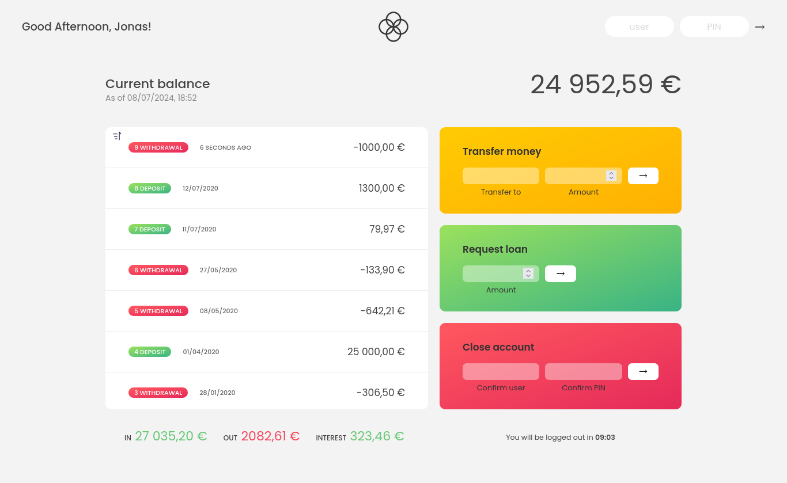
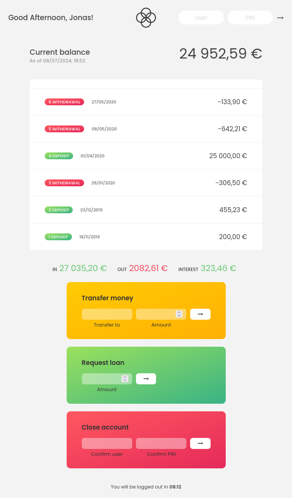
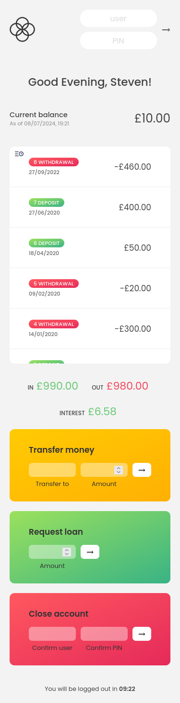

# Bankist Web Application

Bankist is a simple and modern banking application that allows users to make deposits, withdrawals and request loans from the bank. You can see my implementation of it [here](https://oczywsziysya-bankist.netlify.app). 

This is a project from the Jonas Schmedtmann's JS course, "Working with Arrays" module, you can see his official DEMO [here](https://bankist.netlify.app/). 

## Table of contents
- [Overview](#overview)
    - [Credentials](#credentials)
    - [Screenshots](#screenshots)
        - [Desktop](#desktop)
        - [Tablet](#tablet)
        - [Mobile](#mobile)
- [My experience](#my-experience)
    - [My corrections, modifications and improvements](#my-corrections-modifications-and-improvements)
- [Pending features](#pending-features)

## Overview

My version fixes some bugs that I've noticed on Jonas' implementation, modifies some of the page's behavior in a way that makes more sense to me and features a couple of new things. I'll go into more detail in the next paragraphs.

### Credentials

You can log in as one of the fictional users and play around with the operations! All the modifications are gone when the page is reloaded, though.

| User | Username | PIN | Locale | Currency |
| :----: | :--------: | :---: | :------: | :--------: |
| Jonas Schmedtmann | js | 1111 | pt-PT | EUR |
| Jessica Davis | jd | 2222 | en-US | USD |
| Stewart Thomas Williams | stw | 3333 | en-GB | GBP |
| Sarah Smith | ss | 4444 | pt-BR | BRL |

### Screenshots

#### Desktop

#### Tablet

#### Mobile

## My experience

As a beginner in web-development and programming in general, this is the most exciting project I've undertaken so far, besides its simplicity. I've greatly benefited from it and performed much better than I thought I would. My effort was commendable and has been definitely rewarded with a plethora of fresh knowledge and inspiration. Among the things I learned and honed, it's worth mentioning:

- Extensive practice on the most important built-in array methods, like sort, forEach, find, filter, map, reduce, some, every, etc.
- DOM manipulation and event listeners/handlers.
- Grouping reusable code into functions (DRY principle) and avoiding unnecessary global variables.
- Working with the Date API and nicely formatting dates according to the user's locale with the Intl internationalization API.
- Formatting numbers and currencies according to the user's locale with the Intl internationalization API.
- The main 3 ways of using dynamic variable names:
    - Using the `eval()` function (not recommended).
    - Declaring the variables that'll be accessed dynamically as var variables, and then accessing them through the Global Object with template literals.
    - Wrapping the needed variables (they can be let/const ones) in an object and using template literals to access them (most recommended way).
- Using global state variables to control the application's behavior.
- How to use setTimeout and setInterval to implement an idle timer.
- Even though the HTML/CSS files were provided as starter files, I made the page responsive (it was not responsive *at all*, you can check the [DEMO version](https://bankist.netlify.app/) and see for yourself), which required plenty of modifications on the CSS. I always tended towards Flexbox over Grid, but making this page responsive made me realize that a lot of times using Grid can give you more control over the layout, even when it doesn't look very grid-ish.

### My corrections, modifications and improvements

- The first and most critical bug on Jonas' implementation is the sorting feature. Despite the fact that it correctly sorts the deposits and withdrawals in ascending order, the dates are still being displayed as if the order was chronological. To fix this, I had to join the movements array and the dates array into a map, with the dates being the keys (since the dates are unique, but the movements' values are not) as ISO strings. This allowed me to sort the dates array using the movements as sorting criteria.
- Jonas' log in page has a scrollbar, even though there's nothing to scroll to. This happens because, even though the application's UI is not visible, it *is* being rendered (it simply has `opacity: 0`). "Why not just use `display: none`?", I was asking myself. The thing is, we can't use `display: none` because of the opacity animation. When the user logs in, it takes 1 second for the opacity go from 0 to 1, which generates this cool effect. I removed the nonsensical scroll and preserved the animation by playing with `min-height` and `overflow: hidden` at the document's body. I also had to use `history.scrollRestoration = "manual"` to prevent the page from storing the scroll position when reloading, since this was making my workaround unfeasible and flawed.  
- In the DEMO version, if a transfer or loan is made while the movements are sorted in ascending order, then it goes back to the default chronological order. My implementation keeps the sorting mode until the user relogs or presses the sorting button again.
- My idle timer works a little bit differently. Whenever a user tries to do any kind of action (be it successful or unsuccessful), the timer is reset. Jonas' timer, on the other hand, is reset only when the user successfully transfers money or requests a loan.
- My currency balance date is updated every time the UI changes. Jonas' currency balance date does not change after the user has logged in, even when the UI is updated.
- I implemented a very rudimentary, but functional currency conversion between accounts, all thanks to dynamic variable names. It converts between USD ($), GBP (£), EUR (€) and BRL (R$). On Jonas' version, even though the currency formatting is different for each account (since it's formatted according to the user's locale), the values are the same. For instance, if Jessica (US) transfers 1000 USD to Sarah (BR), Sarah will receive a deposit of 1000 BRL, which is incorrect. My currency conversion rates are hard-coded, though, so this is a point of improvement for the future.
- As mentioned before, I made it responsive accross all screensizes from 1440px to 320px. It could be better, of course, but it works quite well and is much better than having a broken page.
